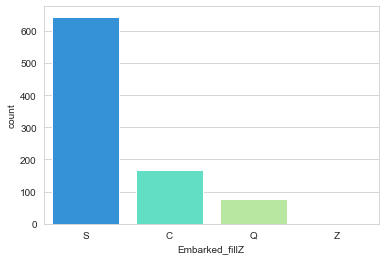

# Machine Learning Project
### [Titanic Data Set from Kaggle](https://www.kaggle.com/c/titanic).
#### Description of variables given
Variable	Definition	Key
survival	Survival	0 = No, 1 = Yes
pclass	Ticket class	1 = 1st, 2 = 2nd, 3 = 3rd
sex	Sex	
Age	Age in years	
sibsp	# of siblings / spouses aboard the Titanic	
parch	# of parents / children aboard the Titanic	
ticket	Ticket number	
fare	Passenger fare	
cabin	Cabin number	
embarked	Port of Embarkation	C = Cherbourg, Q = Queenstown, S = Southampton


```python
import pandas as pd
import numpy as np
import matplotlib.pyplot as plt
import seaborn as sns
%matplotlib inline
```

### Exploring and cleaning the data


```python
train = pd.read_csv('titanic_train.csv')
test = pd.read_csv('titanic_test.csv')
data = pd.concat([train, test])
```

    C:\Users\William\Anaconda3\lib\site-packages\ipykernel_launcher.py:3: FutureWarning: Sorting because non-concatenation axis is not aligned. A future version
    of pandas will change to not sort by default.
    
    To accept the future behavior, pass 'sort=False'.
    
    To retain the current behavior and silence the warning, pass 'sort=True'.
    
      This is separate from the ipykernel package so we can avoid doing imports until
    

We'll process the data as a whole to make it easier to train our model in the subsequent steps


```python
train.columns
```


    Index(['PassengerId', 'Survived', 'Pclass', 'Name', 'Sex', 'Age', 'SibSp',
           'Parch', 'Ticket', 'Fare', 'Cabin', 'Embarked'],
          dtype='object')


```python
train.info()
```

    <class 'pandas.core.frame.DataFrame'>
    RangeIndex: 891 entries, 0 to 890
    Data columns (total 12 columns):
    PassengerId    891 non-null int64
    Survived       891 non-null int64
    Pclass         891 non-null int64
    Name           891 non-null object
    Sex            891 non-null object
    Age            714 non-null float64
    SibSp          891 non-null int64
    Parch          891 non-null int64
    Ticket         891 non-null object
    Fare           891 non-null float64
    Cabin          204 non-null object
    Embarked       889 non-null object
    dtypes: float64(2), int64(5), object(5)
    memory usage: 83.6+ KB
    


```python
train.head()
```


<div>
<style scoped>
    .dataframe tbody tr th:only-of-type {
        vertical-align: middle;
    }

    .dataframe tbody tr th {
        vertical-align: top;
    }

    .dataframe thead th {
        text-align: right;
    }
</style>
<table border="1" class="dataframe">
  <thead>
    <tr style="text-align: right;">
      <th></th>
      <th>PassengerId</th>
      <th>Survived</th>
      <th>Pclass</th>
      <th>Name</th>
      <th>Sex</th>
      <th>Age</th>
      <th>SibSp</th>
      <th>Parch</th>
      <th>Ticket</th>
      <th>Fare</th>
      <th>Cabin</th>
      <th>Embarked</th>
    </tr>
  </thead>
  <tbody>
    <tr>
      <th>0</th>
      <td>1</td>
      <td>0</td>
      <td>3</td>
      <td>Braund, Mr. Owen Harris</td>
      <td>male</td>
      <td>22.0</td>
      <td>1</td>
      <td>0</td>
      <td>A/5 21171</td>
      <td>7.2500</td>
      <td>NaN</td>
      <td>S</td>
    </tr>
    <tr>
      <th>1</th>
      <td>2</td>
      <td>1</td>
      <td>1</td>
      <td>Cumings, Mrs. John Bradley (Florence Briggs Th...</td>
      <td>female</td>
      <td>38.0</td>
      <td>1</td>
      <td>0</td>
      <td>PC 17599</td>
      <td>71.2833</td>
      <td>C85</td>
      <td>C</td>
    </tr>
    <tr>
      <th>2</th>
      <td>3</td>
      <td>1</td>
      <td>3</td>
      <td>Heikkinen, Miss. Laina</td>
      <td>female</td>
      <td>26.0</td>
      <td>0</td>
      <td>0</td>
      <td>STON/O2. 3101282</td>
      <td>7.9250</td>
      <td>NaN</td>
      <td>S</td>
    </tr>
    <tr>
      <th>3</th>
      <td>4</td>
      <td>1</td>
      <td>1</td>
      <td>Futrelle, Mrs. Jacques Heath (Lily May Peel)</td>
      <td>female</td>
      <td>35.0</td>
      <td>1</td>
      <td>0</td>
      <td>113803</td>
      <td>53.1000</td>
      <td>C123</td>
      <td>S</td>
    </tr>
    <tr>
      <th>4</th>
      <td>5</td>
      <td>0</td>
      <td>3</td>
      <td>Allen, Mr. William Henry</td>
      <td>male</td>
      <td>35.0</td>
      <td>0</td>
      <td>0</td>
      <td>373450</td>
      <td>8.0500</td>
      <td>NaN</td>
      <td>S</td>
    </tr>
  </tbody>
</table>
</div>


### Missing values
This is something that we have to deal with later on


```python
sns.heatmap(train.isnull(),yticklabels=False,cbar=False,cmap='viridis')
```


    <matplotlib.axes._subplots.AxesSubplot at 0x1e5a00cd588>


It seems that there are many values in the Age and Cabin variables that are missing.
We can ignore the missing data in Survived column as they are part of the testing data.


```python
#Exploring variables vs the target
sns.set_style('whitegrid')
sns.countplot(x='Survived',data=train,palette='RdBu_r')
```


    <matplotlib.axes._subplots.AxesSubplot at 0x1e5a0837fd0>


The dataset is unbalanced as there are more passengers that died than survived which would affect the accuracy rate of our models

#### Sex feature


```python
sns.countplot(x='Survived',data=train, hue='Sex',palette='RdBu_r')
```


    <matplotlib.axes._subplots.AxesSubplot at 0x1e5a08bb128>


Females have a higher survival rate compared to male

#### SibSp and Parch.
It is likely that there's a possibility if you survive, your family would survive.


```python
plt.figure(figsize=(12,4))
sns.countplot(x='SibSp', data=train, palette='RdBu_r')
```


    <matplotlib.axes._subplots.AxesSubplot at 0x1e5a0902dd8>


```python
plt.figure(figsize=(12,4))
sns.countplot(x='Survived',hue='SibSp',data=train,palette='RdBu_r')
```


    <matplotlib.axes._subplots.AxesSubplot at 0x1e59b34b748>


```python
sns.countplot(x='Parch', data=train, palette='RdBu_r')
```


    <matplotlib.axes._subplots.AxesSubplot at 0x1e5a0a0d208>


```python
sns.countplot(x='Survived',hue='Parch',data=train,palette='RdBu_r')
```


    <matplotlib.axes._subplots.AxesSubplot at 0x1e5a0a88a90>


```python
data['Family_Size'] = data['Parch'] + data['SibSp']
data['Huge_Family'] = data['Family_Size'].apply(lambda x: x if x < 4 else 4)
data['Alone'] = data['Family_Size'] == 1
data['Family_Name'] = data['Name'].str.extract('(\w+),', expand=False)
```


```python
sns.countplot(x='Survived',hue='Family_Size',data=data[:891],palette='RdBu_r')
```


    <matplotlib.axes._subplots.AxesSubplot at 0x1e5a8129940>


```python
sns.countplot(x='Survived',hue='Huge_Family',data=data[:891],palette='RdBu_r')
```


    <matplotlib.axes._subplots.AxesSubplot at 0x1e5a8315ba8>


Huge families are more likely to not survive


```python
sns.countplot(x='Survived',hue='Alone',data=data[:891],palette='RdBu_r')
```


    <matplotlib.axes._subplots.AxesSubplot at 0x1e5a83ac240>


```python
m = data[['Family_Name', 'Survived']].groupby('Family_Name').max()
c = data[['Family_Name', 'PassengerId']].groupby('Family_Name').count()
m = m.rename(columns={'Survived': 'FamilySurvived'})
c = c.rename(columns={'PassengerId': 'FamilyMemberCount'})
m = m.where(m.join(c).FamilyMemberCount > 1, other=-1, axis=1).fillna(-1).join(c)
m['FamilySurvived'] = m.FamilySurvived.astype('int32')
data = data.join(m, on='Family_Name')
```


```python
sns.countplot(x='Survived',hue='FamilySurvived',data=data[:891],palette='rainbow')
```


    <matplotlib.axes._subplots.AxesSubplot at 0x1e5a85eb8d0>


```python
sns.countplot(x='Survived',hue='FamilyMemberCount',data=data[:891],palette='rainbow')
```


    <matplotlib.axes._subplots.AxesSubplot at 0x1e5a8655e48>


#### Pclass
Fare is more expensive in class 1. It shows the social status of passengers and might be a good feature to explore to determine the possibility of survival


```python
sns.boxplot(x='Pclass', y='Fare', data=train, palette='rainbow')
```


    <matplotlib.axes._subplots.AxesSubplot at 0x1e5a0af4898>


```python
sns.countplot(x='Survived',hue='Pclass',data=train,palette='rainbow')
```


    <matplotlib.axes._subplots.AxesSubplot at 0x1e5a0b7e080>


There is a significant amount of survivors that originated from Pclass 3

#### Age


```python
data['Age'] = data['Age'].fillna(data['Age'].median())

```


```python
plt.figure(figsize=(12,4))
sns.distplot(train['Age'],color='darkred',bins=50)
```


    <matplotlib.axes._subplots.AxesSubplot at 0x1e5a3cd55f8>


It seems that majority of the passengers are young adults from 20-30 years old

#### Fare 
Fare and Pclass are correlated


```python
data['Fare'] = data['Fare'].fillna(data['Fare'].median())
```


```python
plt.figure(figsize=(12,4))
sns.distplot(data['Fare'],kde=False,color='darkred',bins=50)
```


    <matplotlib.axes._subplots.AxesSubplot at 0x1e5a0cfa518>


#### Embarked
Those who's Embarked feature are missing has a higher chance to survive


```python
data['Embarked_fillZ'] = data['Embarked'].fillna('Z')
```


```python
sns.countplot(x='Embarked_fillZ', data=data[:891], palette='rainbow')
```


    <matplotlib.axes._subplots.AxesSubplot at 0x1e5a2bced30>





```python
sns.barplot(y='Survived',x='Embarked_fillZ', data=data[:891])
```


    <matplotlib.axes._subplots.AxesSubplot at 0x1e5a2c2c828>


#### Cabin


```python
data['Cabin_Prefix'] = data['Cabin'].str.get(0).fillna('Z')
```


```python
sns.barplot(y='Survived',x='Cabin_Prefix', data=data[:891], palette='rainbow')
```


    <matplotlib.axes._subplots.AxesSubplot at 0x1e5a3cb5c88>


```python
sns.countplot(x='Cabin_Prefix', data=data[:891], palette='rainbow')
```


    <matplotlib.axes._subplots.AxesSubplot at 0x1e5a4055ac8>


Cabin prefix is not very useful in determining survival rate


```python
data['Have_Cabin'] = (data['Cabin'].str.get(0).fillna('Z') != 'Z').astype('int32')
```


```python
sns.countplot(x='Have_Cabin', data=data[:891], palette='rainbow')
```


    <matplotlib.axes._subplots.AxesSubplot at 0x1e5a4067048>


```python
sns.barplot(y='Survived',x='Have_Cabin', data=data[:891], palette='rainbow')
```


    <matplotlib.axes._subplots.AxesSubplot at 0x1e5a4453860>


Those that have cabins are more likely to survive

#### Name
There are lots of feature engineering we can do to names


```python
data['Title'] = data['Name'].str.extract('([A-Za-z]+)\.', expand=False)
```


```python
train['Title'].unique()
```


    array(['Mr', 'Mrs', 'Miss', 'Master', 'Don', 'Rev', 'Dr', 'Mme', 'Ms',
           'Major', 'Lady', 'Sir', 'Mlle', 'Col', 'Capt', 'Countess',
           'Jonkheer'], dtype=object)


```python
sns.countplot(x='Title', data=data[:891], palette='rainbow')
```


    <matplotlib.axes._subplots.AxesSubplot at 0x1e5a468e1d0>


```python
mappings = {
    'Mlle': 'Miss',
    'Ms': 'Miss', 
    'Dona': 'Mrs',
    'Mme': 'Miss',
    'Lady': 'Mrs', 
    'Master': 'Royal',
    'Capt': 'Royal', 
    'Countess': 'Royal', 
    'Major': 'Royal', 
    'Col': 'Royal', 
    'Sir': 'Royal', 
    'Don': 'Royal',
    'Jonkheer': 'Royal', 
    'Rev': 'Royal',
    'Dr': 'Royal'
}
data['Title_Mapped'] = data['Title'].replace(mappings)
```


```python
sns.countplot(x='Title_Mapped', data=data[:891], palette='rainbow')
```


    <matplotlib.axes._subplots.AxesSubplot at 0x1e5a46272e8>


```python
sns.countplot(x='Title_Mapped',hue='Survived', data=data[:891], palette='rainbow')
```


    <matplotlib.axes._subplots.AxesSubplot at 0x1e5a3d4f828>


It is sad to see that most passengers that have 'Mr' did not survive and they are men while 'Mrs' and 'Miss' are more likely to survive

#### Ticket 
This assumes that if the ticket number is close to one another, then they are bought around the same time and their cabin/locations are nearby each other.
Clustering is used to group tickets with similar numbers


```python
from scipy.cluster.hierarchy import linkage, fcluster
```


```python
ticket_num = data['Ticket'].str.extract('(\d+$)', expand=False).fillna(0).astype(int).ravel()
n_cluster = []
for x in range(1,201,2):
    Z = linkage(ticket_num.reshape(data.shape[0], 1), 'single')
    clusters = fcluster(Z, x, criterion='distance')
    data['Ticket_Code'] = clusters
    n_cluster.append(data['Ticket_Code'].unique().shape[0] )
```


```python
plt.figure(figsize=(12,6))
sns.jointplot(x=range(1,201,2), y=n_cluster, kind='reg')
```


    <seaborn.axisgrid.JointGrid at 0x1e5a7e4f320>


    <Figure size 864x432 with 0 Axes>


```python
#choosing optimal d = 25
optimal_d = 25
Z = linkage(ticket_num.reshape(data.shape[0], 1), 'single')
clusters = fcluster(Z, optimal_d, criterion='distance')
data['Ticket_Code'] = clusters
```


```python
sns.distplot(data['Ticket_Code'])
```


    <matplotlib.axes._subplots.AxesSubplot at 0x1e5a8b03550>


```python
import itertools
```


```python
count = data[['PassengerId', 'Ticket_Code']].groupby('Ticket_Code').count().rename(columns={'PassengerId': 'Number'})
data['Ticket_Code_Mapped'] = data['Ticket_Code'].replace(dict(zip(count.index[count.Number <= 10], itertools.cycle([0]))))
```


```python
plt.figure(figsize=(12,6))
sns.countplot(x='Ticket_Code_Mapped', hue='Survived', data=data[:891], palette='rainbow')
```


    <matplotlib.axes._subplots.AxesSubplot at 0x1e5aa427898>


Cluster 180, 183 have high survival rate


```python
data.corr()['Survived'].drop('Survived').sort_values().plot(kind='bar')
```


    <matplotlib.axes._subplots.AxesSubplot at 0x1e5aa427240>


```python
from sklearn.preprocessing import LabelEncoder, StandardScaler
```


```python
scaler = StandardScaler()
le = LabelEncoder()
```


```python
data['Fare_Final'] = scaler.fit_transform(data['Fare'].values.reshape(-1,1))
data['Age_Final'] = scaler.fit_transform(data['Age'].values.reshape(-1,1))
```


```python
data['Embarked_Final'] = le.fit_transform(data['Embarked_fillZ'].values.reshape(-1,1))
data['Ticket_Final'] = le.fit_transform(data['Ticket_Code_Mapped'].values.reshape(-1,1))
data['Huge_Family_Final'] = le.fit_transform(data['Huge_Family'].values.reshape(-1,1))
data['Pclass_Final'] = le.fit_transform(data['Pclass'].values.reshape(-1,1))
data['Have_Cabin_Final'] = le.fit_transform(data['Have_Cabin'].values.reshape(-1,1))
data['Sex_Final'] = le.fit_transform(data['Sex'].values.reshape(-1,1))
data['Title_Final'] = le.fit_transform(data['Title_Mapped'].values.reshape(-1,1))
data['Alone_Final'] = le.fit_transform(data['Alone'].values.reshape(-1,1))

```


```python
data['Alone_Final'].value_counts()
```


    0    1074
    1     235
    Name: Alone_Final, dtype: int64


```python
data.info()
```

    <class 'pandas.core.frame.DataFrame'>
    Int64Index: 1309 entries, 0 to 417
    Data columns (total 34 columns):
    Age                   1309 non-null float64
    Cabin                 295 non-null object
    Embarked              1307 non-null object
    Fare                  1309 non-null float64
    Name                  1309 non-null object
    Parch                 1309 non-null int64
    PassengerId           1309 non-null int64
    Pclass                1309 non-null int64
    Sex                   1309 non-null object
    SibSp                 1309 non-null int64
    Survived              891 non-null float64
    Ticket                1309 non-null object
    Embarked_fillZ        1309 non-null object
    Cabin_Prefix          1309 non-null object
    Have_Cabin            1309 non-null int32
    Title                 1309 non-null object
    Title_Mapped          1309 non-null object
    Ticket_Code           1309 non-null int32
    Family_Size           1309 non-null int64
    Huge_Family           1309 non-null int64
    Alone                 1309 non-null bool
    Family_Name           1309 non-null object
    FamilySurvived        1309 non-null int32
    FamilyMemberCount     1309 non-null int64
    Ticket_Code_Mapped    1309 non-null int64
    Fare_Final            1309 non-null float64
    Age_Final             1309 non-null float64
    Embarked_Final        1309 non-null int32
    Ticket_Final          1309 non-null int64
    Huge_Family_Final     1309 non-null int64
    Pclass_Final          1309 non-null int64
    Have_Cabin_Final      1309 non-null int64
    Sex_Final             1309 non-null int32
    Title_Final           1309 non-null int32
    dtypes: bool(1), float64(5), int32(6), int64(12), object(10)
    memory usage: 358.3+ KB
    


```python
data.corr()['Survived'].drop('Survived').sort_values().plot(kind='bar')
```


    <matplotlib.axes._subplots.AxesSubplot at 0x1e5ab0a9fd0>


```python
chosen_features = [
    'Have_Cabin_Final',
    'FamilySurvived',
    'Fare_Final',
    'Alone_Final',
    'Huge_Family_Final',
    'Title_Final',
    'Age_Final',
    'Embarked_Final',
    'Pclass_Final',
    'Sex_Final',
]
chosen_data = data[chosen_features]
```


```python
X_train = chosen_data[:train.shape[0]]
X_test = chosen_data[train.shape[0]:]
y_train = data[:train.shape[0]].Survived
```


```python

```


```python
import xgboost as xgb
from xgboost import XGBClassifier
from sklearn.model_selection import GridSearchCV
from sklearn.metrics import confusion_matrix, classification_report, f1_score, accuracy_score
```


```python
params = {'n_estimators': [10,30,50,100,200],
          'learning_rate': [0.01,0.05,0.075,0.1],
          'max_depth': [2,3,4,5,6],
         }
```


```python
xgb = GridSearchCV(XGBClassifier(), params, scoring = 'roc_auc', cv = 10, n_jobs = 4, verbose = 2)
xgb = xgb.fit(X_train, y_train)
```

    Fitting 10 folds for each of 100 candidates, totalling 1000 fits
    

    [Parallel(n_jobs=4)]: Using backend LokyBackend with 4 concurrent workers.
    [Parallel(n_jobs=4)]: Done 233 tasks      | elapsed:   10.5s
    [Parallel(n_jobs=4)]: Done 626 tasks      | elapsed:   23.2s
    [Parallel(n_jobs=4)]: Done 1000 out of 1000 | elapsed:   37.5s finished
    


```python
print("Best parameters found: ", xgb.best_params_)
print("Best accuracy found: ", xgb.best_score_)
```

    Best parameters found:  {'learning_rate': 0.1, 'max_depth': 4, 'n_estimators': 30}
    Best accuracy found:  0.9218297401832096
    


```python
xgb_pred = xgb.predict(X_train)
```


```python
print(classification_report(y_train, xgb_pred))
```

                  precision    recall  f1-score   support
    
             0.0       0.87      0.95      0.91       549
             1.0       0.91      0.77      0.84       342
    
        accuracy                           0.88       891
       macro avg       0.89      0.86      0.87       891
    weighted avg       0.89      0.88      0.88       891
    
    


```python
xgb_f1 = f1_score(y_train, xgb_pred)
```


```python
xgb_acc = accuracy_score(y_train, xgb_pred)
```


```python
y_test = pd.Series(xgb.predict(X_test), name="Survived", dtype='int32')
results = pd.concat([data[train.shape[0]:].PassengerId, y_test], axis=1)
```


```python
results.to_csv("xgb_submission.csv",index=False)
```

#### Trying out other models


```python
from sklearn.linear_model import LogisticRegression
from sklearn.svm import LinearSVC
from sklearn.ensemble import GradientBoostingClassifier, RandomForestClassifier, AdaBoostClassifier
```


```python
training_config = {
    'gbdt': {
        'clf': GradientBoostingClassifier(),
        'parameters': {
            'n_estimators': [10,50,100,200],
            'learning_rate': [0.05, 0.1],
            'max_depth': [2,3,4],
            'min_samples_leaf': [2,3],
        },
        'n_jobs': 4,
        'one_hot': False
    },
    'lr' : {
        'clf': LogisticRegression(solver='lbfgs'),
        'parameters': {
            'penalty': ['l2'],
            'C': list(np.arange(0.5, 8.0, 0.1))
        }
    },
    'svm': {
        'clf': LinearSVC(),
        'parameters': {
            'penalty': ['l2'],
            'loss': ['hinge', 'squared_hinge'],
            'C': list(np.arange(0.5, 8.0, 0.1))
        }
    },
    'rfc': {
        'clf': RandomForestClassifier(),
        'parameters': {
            'n_estimators': [10,50,100,200],
            'criterion': ['gini', 'entropy'],
            'max_depth': [2,3,4],
            'min_samples_leaf': [2,3],
        },
        'n_jobs': 4,
        'one_hot': False
    },
    'ada': {
        'clf': AdaBoostClassifier(),
        'parameters': {
            'n_estimators': [10,50,100,200],
            'learning_rate': [0.05, 0.1, 0.5, 1.0, 2.0],
        },
        'n_jobs': 4,
        'one_hot': False
    }
}
```


```python
results = { 'name': [], 'f1': [], 'accuracy': [] }
train_pred = {}
test_pred = {}
for name in training_config.keys():
    conf = training_config[name]
    clf = conf['clf']
    parameters = conf['parameters']
    n_jobs = conf.get('n_jobs', 1)


    print('=' * 20)
    print('Starting training:', name)
    grid_obj = GridSearchCV(clf, parameters, scoring = 'roc_auc', cv = 10, n_jobs = n_jobs, verbose = 2)

    
    print('Number of Features:', X_train.columns.shape[0])
    grid_obj = grid_obj.fit(X_train, y_train)
    best_clf = grid_obj.best_estimator_ 
    
    print('Best classifier:', repr(best_clf))
    model = best_clf.fit(X_train, y_train)
    pred_y = best_clf.predict(X_train)
    train_pred[name] = pred_y

    f1 = f1_score(y_train, pred_y)
    acc = accuracy_score(y_train, pred_y)
    results['name'].append(name)
    results['f1'].append(f1)
    results['accuracy'].append(acc)
    

    test_y = pd.Series(best_clf.predict(X_test), name="Survived", dtype='int32')
    test_pred[name] = test_y
    output = pd.concat([test.PassengerId, test_y], axis=1)
    
    output_filename = name + "_submission.csv"
    print('Writing submission file:', output_filename)
    output.to_csv(output_filename, index=False)
```


```python
results['name'].append('xgboost')
results['f1'].append(xgb_f1)
results['accuracy'].append(xgb_acc)
```


```python
pd.DataFrame.from_dict(results)
```


<div>
<style scoped>
    .dataframe tbody tr th:only-of-type {
        vertical-align: middle;
    }

    .dataframe tbody tr th {
        vertical-align: top;
    }

    .dataframe thead th {
        text-align: right;
    }
</style>
<table border="1" class="dataframe">
  <thead>
    <tr style="text-align: right;">
      <th></th>
      <th>name</th>
      <th>f1</th>
      <th>accuracy</th>
    </tr>
  </thead>
  <tbody>
    <tr>
      <th>0</th>
      <td>gbdt</td>
      <td>0.769231</td>
      <td>0.851852</td>
    </tr>
    <tr>
      <th>1</th>
      <td>lr</td>
      <td>0.773212</td>
      <td>0.832772</td>
    </tr>
    <tr>
      <th>2</th>
      <td>svm</td>
      <td>0.770865</td>
      <td>0.830527</td>
    </tr>
    <tr>
      <th>3</th>
      <td>rfc</td>
      <td>0.817170</td>
      <td>0.870932</td>
    </tr>
    <tr>
      <th>4</th>
      <td>ada</td>
      <td>0.824060</td>
      <td>0.868687</td>
    </tr>
    <tr>
      <th>5</th>
      <td>xgboost</td>
      <td>0.835962</td>
      <td>0.883277</td>
    </tr>
  </tbody>
</table>
</div>


It can be seen that xgboost has the best f1 score and accuracy compared to other models.

#### What was the main challenge
- Feature engineering; majority of the time is spent on exploring and finding out the key features that can improve accuracy of the model

#### What can be done for further improvements
- Discover more effective features via feature engineering


```python

```
